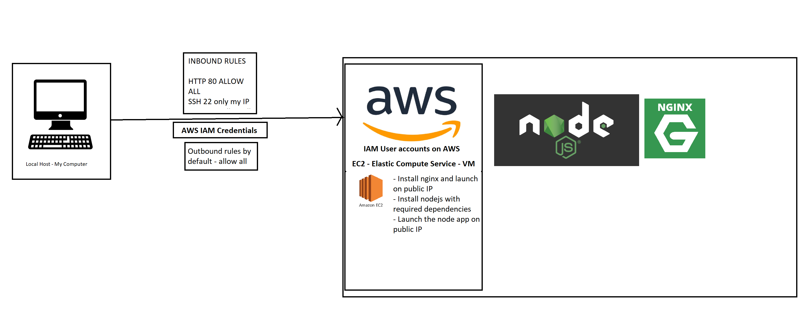
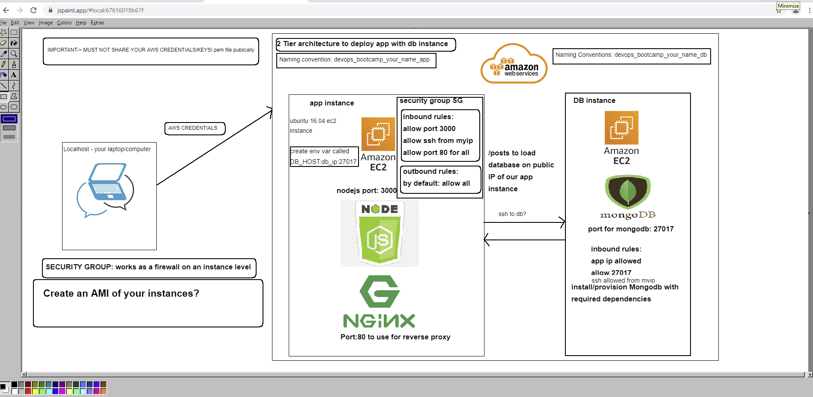

# Cloud Computing and AWS

## Creating an Instance
1. Login to AWS and enter the EC2 Page
2. Press `Launch Instance` button
3. Select your AMI, for this example select `Ubuntu Server 16.04 LTS (HVM), SSD Volume Type` and then move to the next step
4. Choose your instance type, for this example select `t2 micro` and then move to the next step
5. Select your preferred Network
6. Select your preferred Subnet
7. Set auto assigne public IP to `Enable` and move onto the next step
8. Leave storage as it is, and move onto the next step
9. Add a tag, with the desired name of your instance, and move onto the next step
10. Change the name of the security group to your desiered name
11. Set the source of the first rule to: `My IP`
12. Create a new rule and set the Type to `HTTP`, then set the Source to `Anywhere`
13. Create a new rule, leaving the Type as default, then set the Port Range to `3000`, then move onto the next step.
14. Place a new, or existing security group .pem file into your .ssh file (c/users/name/.shh)
15. Select that file as your security group key pair
16. Finish instance creation

## Creating a DB instance
Progress to the security group stage as in the previous steps, then:
1. Set ssh port source to `My IP`
2. Create a new rule, and set Port Range to `27017`, and set the source to: `Anywhere`
3. Create 1 more rule, setting the Type to `HTTP`, and set the source to `Anywhere`

## Starting the node application with your EC2 Instance
1. After creating your EC2 instance, copy the app folder to the virtual machine, to do this use: `scp -i [.pem file] -r [app location path] ubuntu@[remote client]:[remote location path]` This will copy the files over, make sure to be in your ssh folder when you run this.
2. Run a provision file containing the commands required to install nodejs, this will contain the following commands:
```
sudo apt-get update -y
sudo apt-get upgrade -y
sudo apt-get install nginx -y
sudo systemctl start nginx
sudo apt-get install python-software-properties -y
sudo apt-get install npm -y
curl -sL https://deb.nodesource.com/setup_6.x | sudo -E bash -
sudo apt-get install nodejs -y
sudo npm install pm2 -g
cd app
npm install
```
3. In order to ssh into the remote virutal machine, use `ssh -i devop_bootcamp.pem ubuntu@[remote client]`, from there you can use the virutal machine.
4. You can now run the application as normal by using `cd app` and then `node app.js`. You should be able to access the Port 3000 page by using your public IP (available by accessing `Connect to instance -> EC2 Instance connect` on the instance page.
5. To reverse proxy you need change the default file in /etc/nginx/sites-available/default and replace with this:
```
server {
        listen 80;
        server_name _;
        location / {
                proxy_pass http://[public IP]:3000;
                proxy_http_version 1.1;
                proxy_set_header Upgrade $http_upgrade;
                proxy_set_header Connection 'upgrade';
                proxy_set_header Host $host;
                proxy_cache_bypass $http_upgrade;
        }
}
```
6. Restart nginx and run `node app.js` again and the reverse port should redirect from the default nginx page to the 3000 port.

[remote client] - example: `ubuntu@ec2-54-78-54-144.eu-west-1.compute.amazonaws.com` (available on `Connect to instance -> SSH client`)
[remote location path] - example: `/home/ubuntu/app`

## Setting up AWS multi machine
- Create 2 git bash instances, ssh one into the app instance and the other into the db instance
- follow the steps on the following readme: [Multi Machine README](https://github.com/Pshaw397/Multi_Machine/blob/main/README.md)

AWS Diagram


AWS Multi Machine diagram


